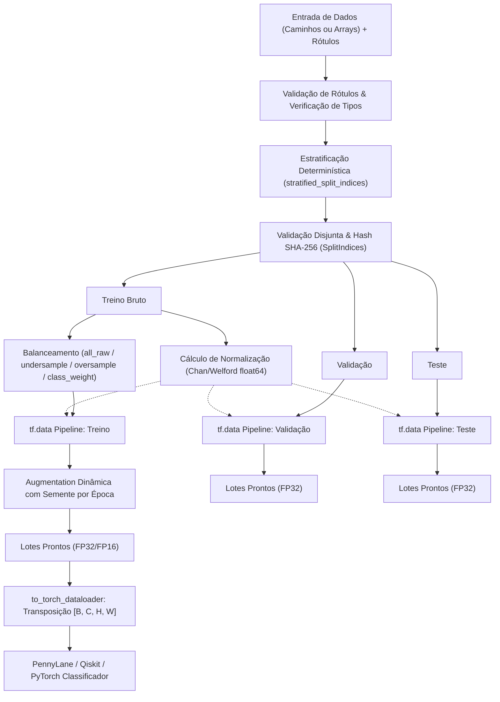

# Relatório Técnico: Pipeline Determinístico de Dados (`src/data_prep.py`)
**Projeto**: TCC — Comparação de Cabeças de Classificação Clássicas e Quânticas (PyTorch / PennyLane / Qiskit)  
**Módulo**: `src/data_prep.py`  
**Data**: 2026-09-22  

---

## 1. Sumário Executivo

O módulo [`src/data_prep.py`](file:///c:/Users/matheus.sduda/repos/projeto-TCC/src/data_prep.py) é o motor central de ingestão, particionamento, pré-processamento, balanceamento e aumento de dados do projeto de TCC. Ele foi concebido sob princípios estritos de **reprodutibilidade científica**, **prevenção de vazamento de dados (*data leakage*)** e **independência de formato em disco**.

O pipeline suporta até 10 conjuntos de dados heterogêneos (como CIFAR-10, GTSRB, MNIST, EMNIST, SVHN, etc.), oferecendo:
- Particionamento estratificado determinístico (70% treino, 15% validação, 15% teste) com rastreamento criptográfico via hash SHA-256 (*fingerprint*).
- Estatísticas de normalização Z-score calculadas exclusivamente sobre o conjunto de treino bruto via formulação paralela de Chan/Welford em precisão `float64`.
- Quatro estratégias mutuamente exclusivas de balanceamento de classes (`all_raw`, `class_weight`, `undersample`, `oversample`) aplicadas estritamente ao treino.
- Aumento de dados (*data augmentation*) controlado, livre de corrupção semântica em placas de trânsito e caracteres assimétricos (`flip_lr=False` por padrão).
- Compatibilidade nativa com tensores PyTorch (`float32`, canais no formato `[B, C, H, W]`) para integração com classificadores clássicos e camadas quânticas (`TorchLayer` do PennyLane e `EstimatorQNN` do Qiskit).

---

## 2. O Que o Código Faz

O módulo resolve os seguintes desafios experimentais:
1. **Padronização de Interface**: Converte qualquer entrada (lista de caminhos de arquivos em disco, arrays NumPy densos ou listas de matrizes de imagens heterogêneas) em um pipeline uniforme do TensorFlow (`tf.data.Dataset`).
2. **Separação Estratificada Fiel**: Garante que todas as classes estejam representadas nas partições de treino, validação e teste com a proporção exata solicitada, mesmo em classes com pouquíssimas amostras.
3. **Isolamento Experimental**: Impede qualquer tipo de vazamento de informação entre treino e avaliação. Amostras de validação e teste nunca são aumentadas, rebalanceadas ou utilizadas no cálculo de média e desvio padrão.
4. **Gerenciamento de Recursos e Memória**: Avalia o impacto em memória antes de ativar cache em RAM (`.cache()`) e dimensiona dinamicamente os buffers de embaralhamento (*shuffle*) para evitar esgotamento de memória (*Out of Memory* / OOM).
5. **Interoperabilidade**: Alimenta tanto modelos Keras clássicos quanto circuitos variacionais quânticos em PyTorch através da função ponte [`to_torch_dataloader`](file:///c:/Users/matheus.sduda/repos/projeto-TCC/src/data_prep.py#L747).

---

## 3. Como o Código Faz (Análise Arquitetural e Metodológica)

### 3.1. Tratamento e Validação de Rótulos
- **`_as_label_array(labels)`**:
  Converte a sequência para `np.ndarray` 1D com tipo `int64`. Rejeita tensores multidimensionais, conjuntos vazios e rótulos negativos. Aceita tipos de ponto flutuante somente se representarem inteiros exatos (ex: `0.0` para `0`), evitando conversões com perda que mascarariam erros no cálculo de perdas esparsas (*sparse categorical cross-entropy*).
- **`class_counts(labels)`**:
  Gera um mapeamento `{classe: contagem}` ordenado e serializável em JSON.

### 3.2. Particionamento Estratificado e Rastreabilidade (`SplitIndices`)
- **`_allocate_class_counts(count, fractions)`**:
  Implementa o método dos maiores restos (algoritmo de Hamilton) adaptado para aprendizado de máquina. Garante que qualquer partição ativa com fração maior que zero receba no mínimo 1 exemplar da classe (se houver amostras suficientes). O restante é alocado iterativamente na partição que apresentar o maior déficit em relação à sua meta contínua.
- **`stratified_split_indices(...)`**:
  Aplica a alocação classe a classe com um gerador independente `np.random.default_rng(seed)`.
- **`SplitIndices.validate(total_size)`**:
  Verifica se as uniões de treino, validação e teste são estritamente disjuntas (interseção nula) e se indexam todos os índices de $0$ a $N-1$.
- **`SplitIndices.fingerprint()`**:
  Gera um digest SHA-256 a partir dos bytes dos índices em inteiros de 64 bits little-endian prefixados pelos nomes das partições. Isso viabiliza a auditoria formal exigida pelo protocolo do TCC.

### 3.3. Ingestão Polimórfica e Decodificação de Imagens
- **`_make_source_dataset(...)`**:
  Detecta se as amostras são caminhos em disco (`Path`/`str`), arrays NumPy empilhados em memória ou listas de imagens com resoluções distintas:
  - Para caminhos: cria `tf.data.Dataset.from_tensor_slices` com tensores de strings.
  - Para arrays: cria o dataset diretamente a partir de slices em memória.
  - Para listas heterogêneas: instancia um `Dataset.from_generator` com `output_signature` tipada para evitar a criação de arrays NumPy irregulares (*ragged*).
- **`_decode_resize_image(...)`**:
  - Imagens padrão (PNG, JPEG, BMP) são decodificadas em C++ via `tf.io.decode_image`.
  - Imagens `.ppm` (padrão oficial do dataset GTSRB) são direcionadas para o Pillow através de `tf.numpy_function`.
  - Converte imagens em escala de cinza para RGB ou vice-versa, conforme a especificação do experimento.
  - Aplica `tf.image.resize_with_pad` com interpolação bilinear e antialiasing, preservando a proporção de aspecto (*aspect ratio*) original e preenchendo as bordas com zeros (padding preto).

### 3.4. Normalização com Estabilidade Numérica (Chan / Welford)
- **`compute_normalization_stats(...)`**:
  No modo `"zscore"`, abandona a fórmula ingênua $\mathbb{E}[X^2] - (\mathbb{E}[X])^2$ (suscetível a cancelamento catastrófico) em favor do algoritmo de Chan et al. (1979) para cálculo em lotes do método de Welford:
  $$\Delta = \mu_B - \mu_A$$
  $$\mu_{AB} = \mu_A + \Delta \cdot \frac{n_B}{n_{AB}}$$
  $$M_{2,AB} = M_{2,A} + M_{2,B} + \Delta^2 \cdot \frac{n_A \cdot n_B}{n_{AB}}$$
  $$\sigma^2 = \frac{M_{2,AB}}{n_{AB}}$$
  Todo o acúmulo ocorre em precisão dupla (`float64`) em uma única passagem pelo conjunto de treino, adicionando $\epsilon = 10^{-6}$ para evitar divisão por zero.

### 3.5. Estratégias de Balanceamento de Classes
- **`balance_training_data(...)`**:
  - `"all_raw"`: Não altera o conjunto de dados.
  - `"class_weight"`: Calcula os pesos das classes conforme a fórmula balanceada padrão:
    $$w_c = \frac{N_{total}}{K \cdot N_c}$$
    onde $K$ é o número de classes e $N_c$ é a contagem da classe $c$.
  - `"undersample"`: Amostra aleatoriamente sem reposição cada classe até igualar a contagem da classe minoritária ($\min N_c$).
  - `"oversample"`: Mantém $100\%$ dos exemplos originais e completa o déficit em relação à classe majoritária ($\max N_c$) via amostragem com reposição.

### 3.6. Aumento de Dados (*Data Augmentation*)
- **`AugmentationConfig`**:
  - `flip_lr: bool = False`: Desativado por padrão para garantir a integridade semântica de placas de trânsito (GTSRB) e numerais/caracteres (MNIST, EMNIST, SVHN).
  - Outras transformações: translação reflexiva (`translate_frac`), zoom in/out (`zoom_min`, `zoom_max`), ajuste de brilho e contraste, ruído gaussiano aditivo (`noise_std`) e recorte aleatório com preenchimento da média (*cutout*).
- **Variação por Época com Reprodutibilidade**:
  Quando `vary_augmentation_per_epoch=True`, o índice de semente é composto com um token dinâmico determinístico, garantindo que o modelo seja exposto a variações distintas a cada época de treinamento, sem perder a capacidade de reprodução exata a partir da semente mestre.

### 3.7. Otimizações de Memória e Construção do Pipeline
- **Cache com Limite Orçamentário (`preprocess_cache_max_mib`)**:
  Calcula `count * H * W * C * 4 bytes`. Se a memória couber no orçamento estipulado, invoca `.cache()` em RAM, evitando I/O repetido de disco nas épocas subsequentes.
- **Buffer de Shuffle Bounded (`shuffle_buffer_max_mib`)**:
  Limita o tamanho do buffer de embaralhamento com base na memória disponível, prevenindo travamentos em máquinas com menor capacidade de RAM.
- **Ponte PyTorch (`to_torch_dataloader`)**:
  Iterador que consome tensores do TensorFlow, converte arrays NumPy em tensores PyTorch e permuta as dimensões de `[Batch, Height, Width, Channels]` para `[Batch, Channels, Height, Width]`, enviando opcionalmente os lotes para o dispositivo desejado (`cuda`, `mps`, ou `cpu`).

---

## 4. Recursos e Melhorias Implementadas na Versão Atual

| Recurso / Melhoria | Solução Implementada em `src/data_prep.py` | Impacto no TCC |
| :--- | :--- | :--- |
| **Dtype Rígido em `float16`** | Inclusão de `output_dtype="float32"` por padrão, com suporte a `"float16"` e `"float64"`. | Permite execução estável de circuitos quânticos em PyTorch (PennyLane / Qiskit) sem subfluxo de gradiente. |
| **Flip Horizontal Inseguro** | `flip_lr` alterado para `False` por padrão no `AugmentationConfig`. | Previne corrupção de classes direcionais em GTSRB e dígitos no SVHN/MNIST. |
| **Augmentation Repetitiva** | Inclusão de semente dinâmica controlada por `vary_augmentation_per_epoch`. | Maximiza a capacidade de generalização das redes nas épocas avançadas. |
| **Instabilidade de Variância** | Substituição pelo algoritmo de Chan/Welford em `float64` em um único passo. | Precisão estatística rigorosa mesmo em lotes com baixa variância ou valores altos. |
| **Loop Infinito no Treino** | Parâmetro `repeat` configurável em `build_tf_dataset` e `repeat_train` em `prepare_run_datasets`. | Permite uso tanto com Keras (`steps_per_epoch`) quanto com loops manuais finitos do PyTorch. |
| **Interoperabilidade PyTorch** | Criação da função geradora `to_torch_dataloader`. | Integração imediata com as três cabeças do experimento (Clássica, PennyLane e Qiskit). |
| **Normalização por Imagem** | Adição do modo `"per_image"` (`per_image_standardization`). | Suporte a normalização de contraste e iluminação específica por imagem (útil em FER-2013). |
| **Persistência de Splits** | Métodos `SplitIndices.save(path)` e `SplitIndices.load(path)` (JSON / NPZ). | Permite congelar o particionamento em disco e recarregá-lo nos diferentes scripts de treino. |
| **Auditoria e Manifesto** | Método `PreparedRunDatasets.save_manifest(path)`. | Exporta o manifesto JSON completo com hashes SHA-256 e estatísticas do experimento para a banca. |
| **Otimização PPM $\to$ PNG** | Função utilitária `convert_ppm_to_png(source_dir, target_dir)`. | Elimina o gargalo do Pillow e Python GIL no GTSRB, permitindo decodificação nativa em C++. |

---

## 5. Próximos Passos Recomendados

1. **Executar a Conversão dos Arquivos PPM do GTSRB**:
   - Usar `convert_ppm_to_png("datasets/gtsrb")` para gerar versões PNG nativas de alta performance.
2. **Serialização Opcional para TFRecords / HDF5**:
   - Para acelerar a leitura em discos magnéticos ou pastas compartilhadas de grande porte, considerar a exportação dos lotes decodificados para arquivos lineares unificados.

